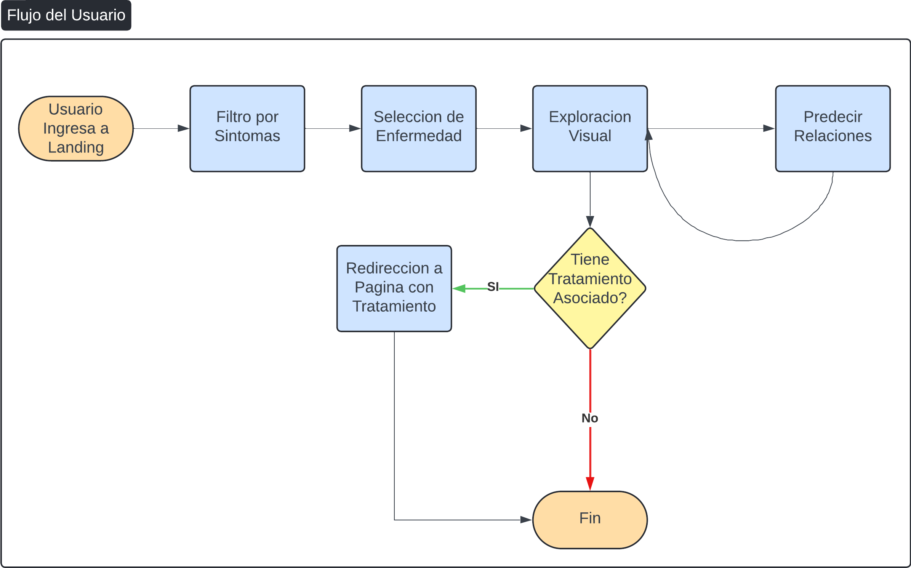
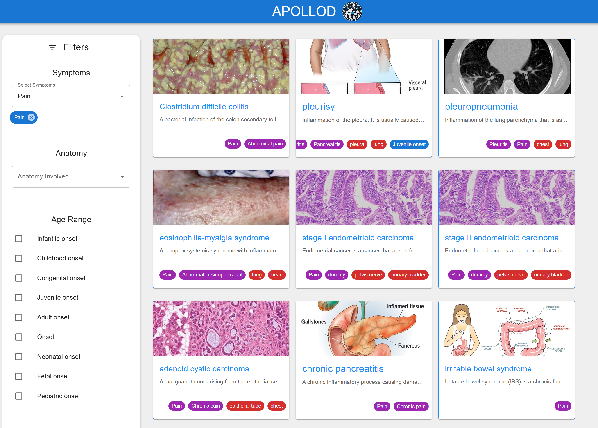
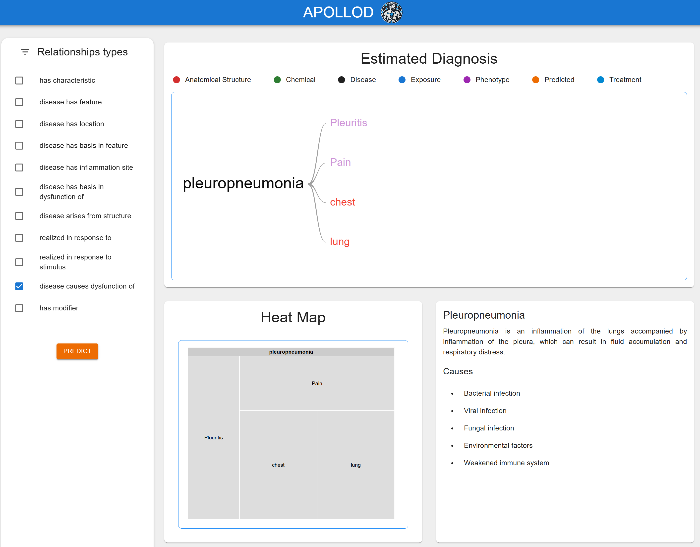

# Repositorio Frontend
Repositorio que contiene:
- Frontend completo de Apollod.

## Requerimientos
- Node js (Version recomendada 20 o mayor).

## Libreria de Componentes
- Apollod se basa principalmente en la libreria de componentes y paleta de Material UI para los componentes base (no graficos de exploracion).
- Para los graficos de exploracion, los componentes provienen de lalibreria Google Charts.

## Scripts disponibles

Dentro del directorio del proyecto se puede ejecutar:

### `npm run dev`

Inicia la aplicación en modo de desarrollo para ejecutarla localmente en el puerto 5173.

### `npm run build`

Crea la aplicación para producción en la carpeta `dist`.\
Realiza el bundle de React en modo de producción y optimiza la compilación para obtener el mejor rendimiento.

### `npm install`

**Nota: este es un proceso único. Asegúrese de ejecutarlo en la misma ubicación que el archivo package.json.

Este comando descarga un paquete y sus dependencias. 

Cuando se ejecuta sin argumentos, npm install descarga las dependencias definidas en un archivo package.json y genera una carpeta node_modules con los módulos instalados.

Cuando se ejecuta con argumentos, npm install descarga módulos específicos a la carpeta node_modules.

### `npm run lint`

Este comando analiza el código en busca de inconsistencias y ayuda a garantizar la calidad y el código limpio.

# Flujo de Apollod

Apollod cuenta con un flujo de dos pantallas, donde en principio se ingresa a la landing, donde se puede buscar enfermedades por filtros. Y una segunda pantalla, donde se puede explorar los datos vinculados de la enfermedad seleccionada. El flujo puede visualizarse en el siguiente diagrama: 

## Landing

## Exploracion Visual

# Manejo de Estados

Considerando la baja complejidad de la interfaz de usuario, se optó por no integrar una librería de manejo de estados dado que agregaría complejidades en el código, sin agregar un aporte significativo a la velocidad de desarrollo, como figura en pantalla.

